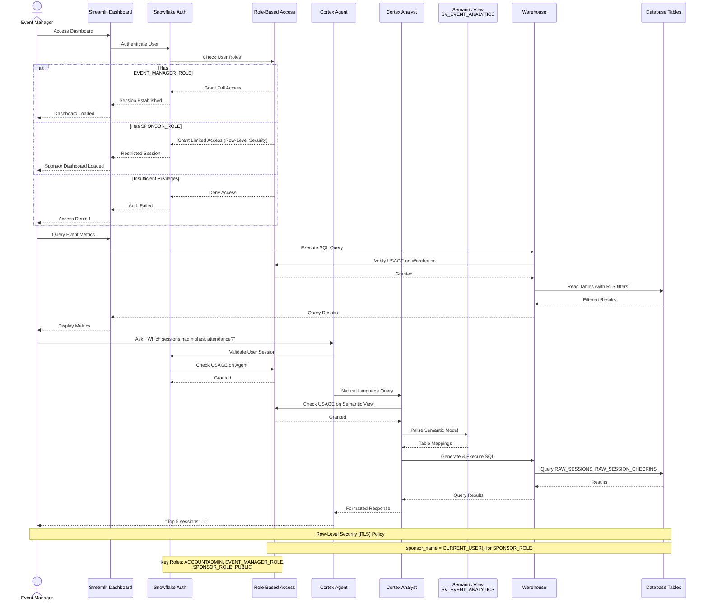

# Auth Flow - Event Intelligence Platform
Author: SE Community
Last Updated: 2025-12-10
Expires: 2026-01-09
Status: Reference Implementation

Reference Implementation: This code demonstrates production-grade architectural patterns and best practices. Review and customize security, networking, and logic for your organization's specific requirements before deployment.

## Overview
Authentication and authorization for Streamlit dashboard users and Cortex Agent requests, including role checks, RLS for sponsors, and semantic-view-based queries.

## Component Descriptions
- Authentication: Snowflake authenticates dashboard and agent requests via HTTPS; sessions inherit RBAC.
- Authorization: Roles gate access; sponsors receive RLS-filtered data; managers get full event view.
- Semantic access: Agent and Analyst operate only through semantic view `SV_EVENT_ANALYTICS`, not raw tables.
- Warehouse policy: Queries execute on `SFE_EVENT_INTELLIGENCE_WH` with role checks for USAGE.

## Change History
See `.cursor/DIAGRAM_CHANGELOG.md` for vhistory.

