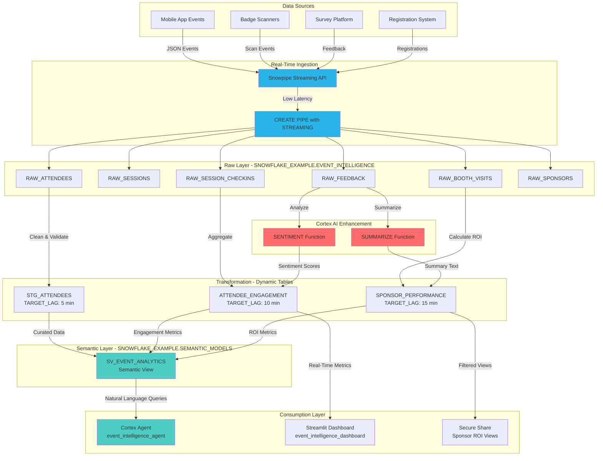

# Data Flow - Event Intelligence Platform
Author: SE Community
Last Updated: 2025-12-10
Expires: 2026-01-09
Status: Reference Implementation

Reference Implementation: This code demonstrates production-grade architectural patterns and best practices. Review and customize security, networking, and logic for your organization's specific requirements before deployment.

## Overview
End-to-end flow from real-time event signals into Snowflake via Snowpipe Streaming, through Dynamic Tables and Cortex AI enrichment, into semantic views consumed by Cortex Agent and Streamlit dashboards, with secure sponsor sharing.

## Component Descriptions
- Ingestion: Snowpipe Streaming API + streaming pipe landing into raw tables.
- Transformation: Dynamic Tables with target lags (5–15 min) for curated engagement/ROI metrics.
- AI Enrichment: Cortex SENTIMENT/SUMMARIZE add qualitative signals to metrics.
- Semantic & Consumption: Semantic view feeds Cortex Agent; dashboards and secure shares consume curated metrics.

## Change History
See `.cursor/DIAGRAM_CHANGELOG.md` for vhistory.

