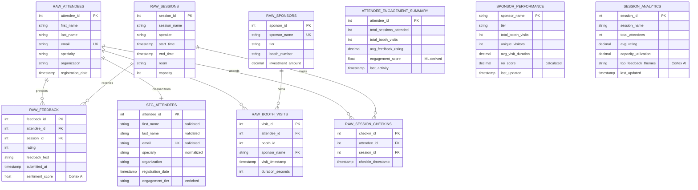

# Data Model - Event Intelligence Platform
Author: SE Community
Last Updated: 2025-12-10
Expires: 2026-01-09
Status: Reference Implementation

Reference Implementation: This code demonstrates production-grade architectural patterns and best practices. Review and customize security, networking, and logic for your organization's specific requirements before deployment.

## Overview
This diagram shows the layered data model for event intelligence: raw ingestion tables for attendees, sessions, booth visits, feedback, and sponsors; staging for validation/enrichment; and analytics/semantic-ready tables for engagement, ROI, and session performance.

## Component Descriptions
- RAW layer: Landing tables for attendees, sessions, check-ins, booth visits, feedback, and sponsors ingested via Snowpipe Streaming.
- STG_ATTENDEES: Cleans and normalizes attendee profiles; seeds engagement tiering.
- Analytics tables: Engagement, sponsor performance, and session analytics for dashboards and semantic views.
- Sentiment fields: Feedback is enriched via Cortex AI sentiment scoring to feed engagement KPIs.

## Change History
See `.cursor/DIAGRAM_CHANGELOG.md` for vhistory.

