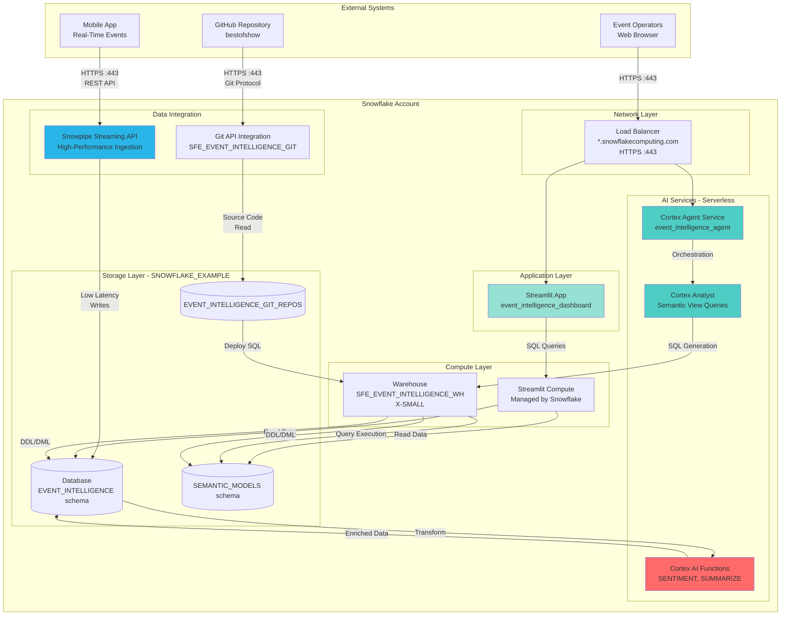

# Network Flow - Event Intelligence Platform
Author: SE Community
Last Updated: 2025-12-10
Expires: 2026-01-09
Status: Reference Implementation

Reference Implementation: This code demonstrates production-grade architectural patterns and best practices. Review and customize security, networking, and logic for your organization's specific requirements before deployment.

## Overview
Network architecture showing external producers, GitHub integration, Snowflake services (compute, storage, AI), and Streamlit app delivery over HTTPS with RBAC-enforced access.

## Component Descriptions
- External producers: Mobile apps and badge scanners send HTTPS events to Snowpipe Streaming API.
- Data integration: Git API integration pulls SQL/Streamlit assets from GitHub into Snowflake git repo schema.
- Compute & AI: Warehouse for SQL/Dynamic Tables; serverless Cortex services for sentiment and agent orchestration.
- Delivery: Streamlit served via Snowflake over HTTPS; load balancer fronts Streamlit and agent endpoints.

## Change History
See `.cursor/DIAGRAM_CHANGELOG.md` for vhistory.

